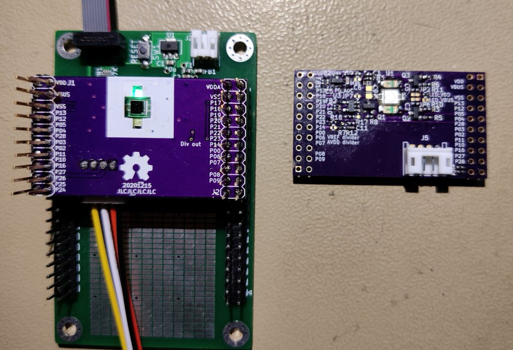
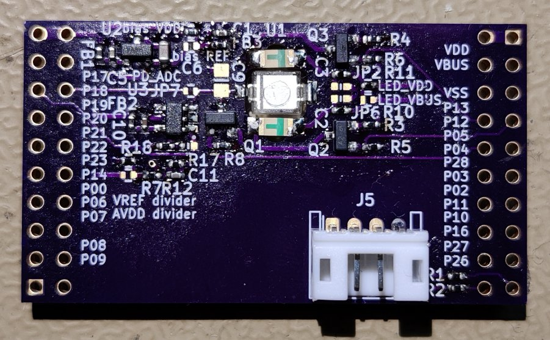

# PPG sensor hardware Version 1.1
After the lessons learned from version 1.0 it is time to hardwire some things that have proven to be useful but also try out some other things:
* Instead of using a comparator, use an ADC to sample
* Switch from LPC812 to LPC824 board
# HSI (Hardware Software Interface)
What microcontroller pins are connected to what hardware and what are the needed settings.
* PIO0_13 is connected to the gate of a transistor that sources current for LED1, pulled down by a 10K resistor, should be set as output. High turns on the drive to LED1.
* PIO0_12 is connected to the gate of a transistor that sources current for LED2, pulled down by a 10K resistor, should be set as output. High turns on the drive to LED2.
* PIO0_4 is connected to the gate of a transistor that resets the integrator capacitor, pulled down by a 10K resistor, should be set as output
* PIO0_25 is connected to UART receive via 100Ohm series resistor, should be set as output
* PIO0_24 is connected to UART transmit via a 100Ohm series resistor, should be set as input
* PIO0_18 is connected to the Photodiode integrator node via a normally open jumper, should be set as analog input
* PIO0_17 is connected to the threshold comparator, should be set as input
## TODO's
Still some things need to be done:
* Test & characterise
* update Readme.md with pictures and BOM
## BOM
This is a list of hardware components. If just mentioned a generic component like a 1K 0402 resistor, just name it as such, free to substitute. If you need some special integrated IC's show some sources like Mouser, Digikey, Farnell, or LCSC
* [SFH2440](https://www.osram.com/ecat/DIL%20SMT%20Ambient%20Light%20Sensor%20SFH%202440/com/en/class_pim_web_catalog_103489/global/prd_pim_device_2219615/) Photodiode
* Shine through PCB mount LEDs
## Pictures

Version 1.1 PPG sensor on a LPC824HI33 nuclone board.

Closeup of the Version 1.1 PPG sensor.
